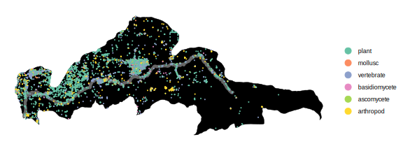
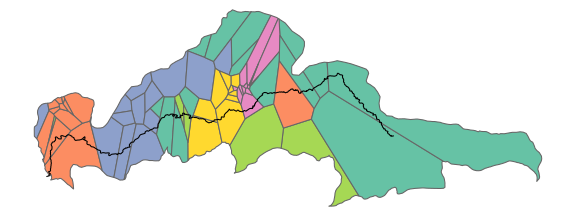

# ecocarta: color-coding beta diversity

ecocarta cuts community science observations into ecoregions and colors them by community composition

## How it works

1. Import GBIF observation data from iNaturalist and other sources
2. Break the area into hexagonal tiles or Voronoi polygons that reflect the density of observations
3. Cluster the ecological communities observed in each cell into groups of similar composition with k-means
4. Arrange the clusters in a gradient according to where their midpoints lie on a 1D NMDS ordination
5. Color-code the tiles by the color of the community clusters

## Usage

The two example RMarkdown scripts linked below give an outline of the steps.

## Examples

### [Sky island](https://jmpowers.github.io/ecocarta/sanjacinto.html)

The land of the [ʔívil̃uqaletem](https://en.wikipedia.org/wiki/Cahuilla), including the altitudinal gradient from the San Jacinto Mountains (green) down to the Coachella Valley (white):

### [Urban watershed](https://jmpowers.github.io/ecocarta/johnsoncreek.html)

Johnson Creek flows west through the suburbs of Portland to the Willamette River.

Diversity and distribution of observations:

Clustering of Voronoi tiles into six ecoregions: 

